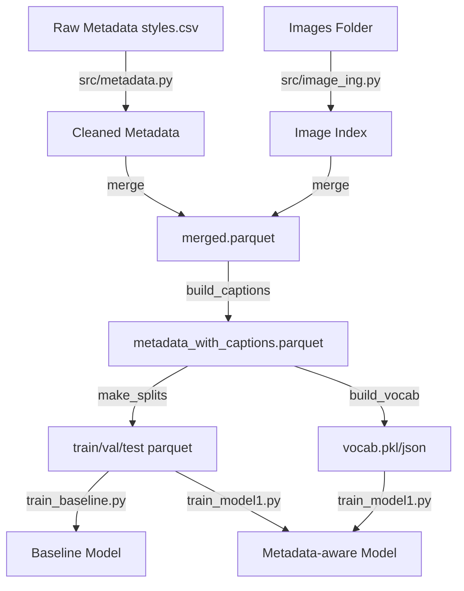

# Image Caption Generator

Fashion captioning toolkit that ingests catalog metadata + product photos, builds marketing-ready captions, and trains Transformer-based image caption models.

## Run Overview (the "picture")



## Prerequisites
- Python 3.10+
- `images/` directory containing `<id>.jpg` files (IDs match `styles.csv` rows)
- `metadata/styles.csv` file from the Fashion Product Images dataset (or similar)
- Recommended: GPU with CUDA (CPU works but is slower)

## 1. Environment Setup
```bash
python3 -m venv .venv
source .venv/bin/activate
pip install -r req.txt
```

## 2. Prepare Data
Run these scripts from the repo root; each writes to `metadata/`.

1. **Clean metadata**
	```bash
	python -m src.metadata
	```
	- Reads `metadata/styles.csv`, fixes `id` types, drops bad rows.

2. **Index images**
	```bash
	python -m src.image_ing
	```
	- Scans `images/` and emits a DataFrame of `image_id → path` (in memory, used by merge).

3. **Merge metadata + image paths**
	```bash
	python -m src.merge
	```
	- Outputs `metadata/merged.parquet` containing all product info plus absolute image paths.

4. **Generate rule-based captions**
	```bash
	python -m src.build_captions
	```
	- Uses `src/data/captions.py::build_caption` to craft marketing copy → `metadata/metadata_with_captions.parquet`.

5. **Create train/val/test splits**
	```bash
	python -m src.make_splits
	```
	- Saves `metadata/train.parquet`, `metadata/val.parquet`, `metadata/test.parquet` (70/15/15 split).

6. **Build vocabulary**
	```bash
	python -m src.build_vocab
	```
	- Normalizes tokens and produces `metadata/vocab.pkl` (training) + `metadata/vocab.json` (debugging/inference).

## 3. Train Models

### Option A: Baseline (images only)
```bash
python -m src.train.train_baseline
```
- Encoder: frozen ResNet50.
- Decoder: Transformer (4 layers) with sinusoidal positional encoding.
- Outputs `baseline_best.pth` when validation loss improves.
- BLEU score computed each epoch via `compute_bleu()`.

### Option B: Metadata-aware Model (`Model1`)
```bash
python -m src.train.train_model1
```
- Encoder: MobileNetV2 features (frozen) + metadata embeddings for 8 categorical fields.
- Dataset: `src/data/dataset_model1.py::FashionDatasetV2` bundles `(image, caption_ids, metadata_ids)`.
- Saves `model1_best.pth` (adjust script if you want a different path).

> ⚙️ Both training scripts store constants (batch size, epochs, learning rate, paths) near the top—tweak them before launching runs.

## 4. Evaluate & Inference

### Quick BLEU evaluation
- `train_baseline.py` already calculates BLEU on the validation set. For test evaluation, adapt the `compute_bleu()` helper to iterate over `metadata/test.parquet`.

### Run inference with the baseline model
```python
import torch
from PIL import Image
from torchvision import transforms
from src.models.caption_model import CaptionModel
from src.data.vocab import FashionVocab

vocab = FashionVocab.load("metadata/vocab.pkl")
model = CaptionModel(vocab).eval()
model.load_state_dict(torch.load("baseline_best.pth", map_location="cpu"))

transform = transforms.Compose([
	 transforms.Resize((224, 224)),
	 transforms.ToTensor(),
	 transforms.Normalize([0.485, 0.456, 0.406], [0.229, 0.224, 0.225])
])

img = transform(Image.open("images/123.jpg").convert("RGB")).unsqueeze(0)

with torch.no_grad():
	 output = model.generate(img, max_len=30)[0]
	 caption = vocab.decode(output)
	 print(caption)
```

## Troubleshooting
- **`FileNotFoundError` for images**: confirm `images/<id>.jpg` filenames match the `id` column in `styles.csv`.
- **`vocab.pkl` missing**: rerun `python -m src.build_vocab` after creating captions.
- **Slow training**: lower `BATCH_SIZE`, shrink image size in `src/data/dataset.py`, or switch to a GPU runtime.

## Next Steps
- Swap rule-based captions with your own generator before training.
- Serve the trained model via FastAPI or Streamlit (dependencies already listed in `req.txt`).

